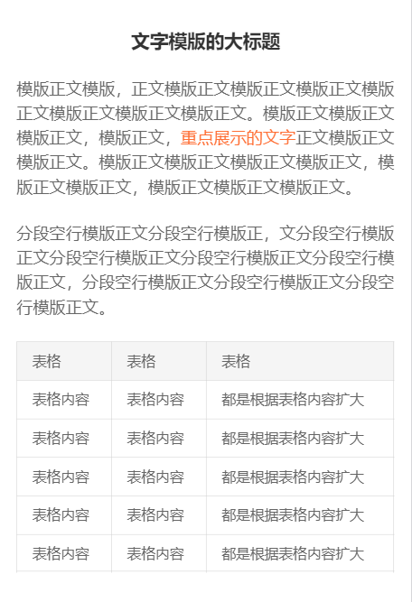
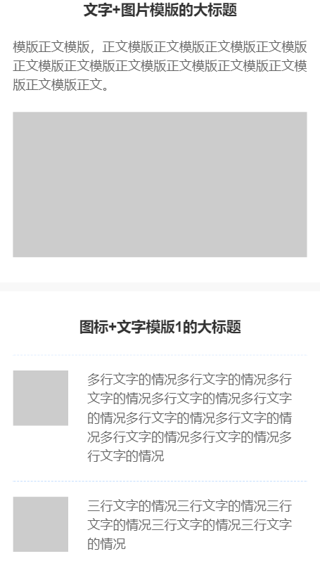
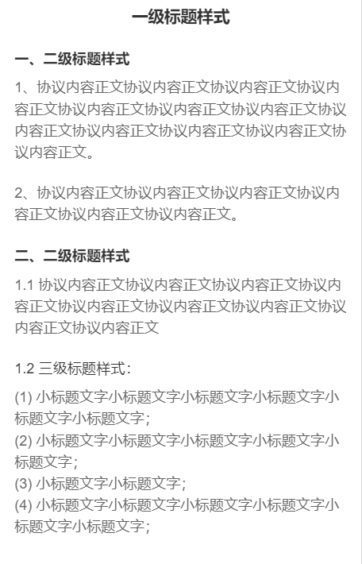

# article

说明介绍页规范, 服务协议、须知类

## 例子








```html
<div class="ui-article">
  <!-- 标题 -->
  <h1 class="ui-article__title ui-article__title--primary">文字模版的大标题</h1>
  <!-- 二级标题 -->
  <h2 class="ui-article__title ui-article__title--small">小标题文字</h2>
  <!-- 三级标题 -->
  <h3 class="ui-article__title ui-article__title--xsmall">小标题文字</h3>

  <!-- 正文 -->
  <p class="ui-article__text">模版正文模版
  <!-- 重点展示的文字 -->
    <span class="ui-artilce__text--em">重点展示的文字</span>
    正文模版
  </p>

  <!-- 图片 -->
  
  <!-- 无下边距的图片 -->
  
  <!-- 图表 -->
  <figure>
    
    <figcaption class="ui-article__figcaption">上方图的名字描述</figcaption>    
  </figure>

  <!-- 媒体对象 -->
  <div class="ui-media">
    <div class="ui-media__left">
      
    </div>
    <div class="ui-media__body">
      <p>一行文字的情况一行文字的情况</p>
      <a class="ui-media__link" href="https://jyb.jyblife.com">链接文字的情况</a>
    </div>
  </div>
  <!-- 表格 -->
  <table class="ui-artilce__table">
    <thead>
      <tr>
        <th>表格</th>
        <th>表格</th>
        <th>表格</th>
      </tr>
    </thead>
    <tbody>
      <tr>
        <td>表格内容</td>
        <td>表格内容</td>
        <td>都是根据表格内容扩大</td>
      </tr>
      <tr>
        <td>表格内容</td>
        <td>表格内容</td>
        <td>都是根据表格内容扩大</td>
      </tr>
      <tr>
        <td>表格内容</td>
        <td>表格内容</td>
        <td>都是根据表格内容扩大</td>
      </tr>
      <tr>
        <td>表格内容</td>
        <td>表格内容</td>
        <td>都是根据表格内容扩大</td>
      </tr>
      <tr>
        <td>表格内容</td>
        <td>表格内容</td>
        <td>都是根据表格内容扩大</td>
      </tr>                                        
    </tbody>
  </table>
</div>
```
