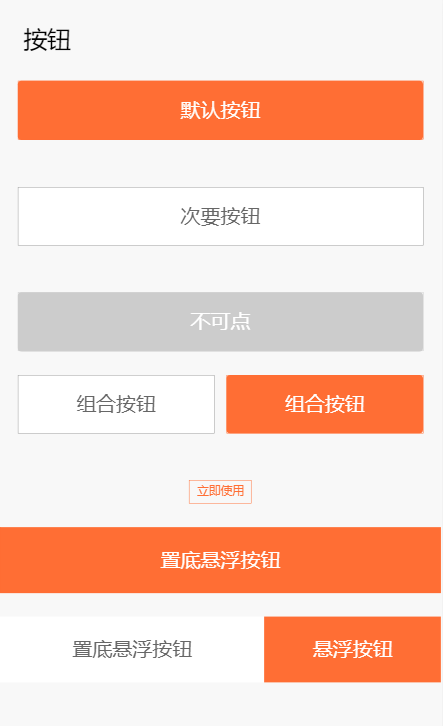

# button

按钮

## 例子



```html
<!-- 默认按钮 -->
<div class="ui-btn ui-btn--primary">默认按钮</div>
<!-- 次要按钮 -->
<div class="ui-btn">次要按钮</div>
<!-- 不可点状态 -->
<div class="ui-btn ui-btn--disabled">不可点</div>

<!-- 组合按钮 -->
<div class="ui-btn-group">
  <div class="ui-btn-group__item ui-btn ui-mr-20">组合按钮</div>
  <div class="ui-btn-group__item ui-btn ui-btn--primary">组合按钮</div>
</div>

<!-- 超小按钮 -->
<div class="ui-btn ui-btn--transparent ui-btn--xsmall hz-c">立即使用</div>

<!-- 置底悬浮按钮 -->
<div class="ui-btn ui-btn--primary ui-btn--xlarge">置底悬浮按钮</div>

<!-- 置底悬浮组合按钮 -->
<div class="ui-btn-group">
  <div class="ui-btn-group__item ui-btn ui-btn--xlarge ui-btn-group__item--flex-2 ui-btn--noborder">置底悬浮按钮</div>
  <div class="ui-btn-group__item ui-btn ui-btn--primary ui-btn--xlarge ui-btn-group__item--flex-3 ui-btn--noborder">悬浮按钮</div>
</div>
```