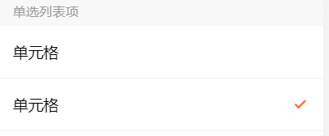
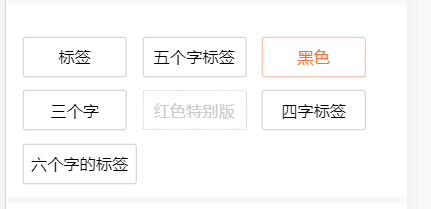
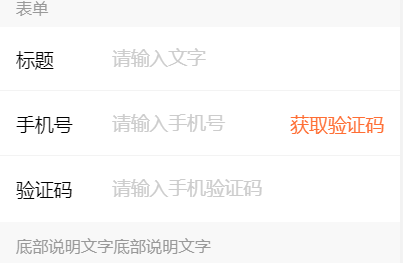

# form 

表单

## 例子

### 单选列表项



```html
<!-- 单选列表项 -->
<div class="ui-info-line">
  <div class="ui-info-item">
    <div class="ui-info-item__desc-left">单元格</div>
    <div class="ui-info-item__desc-right"><i></i></div>
  </div>
  <div class="ui-info-item">
    <div class="ui-info-item__desc-left">单元格</div>
    <div class="ui-info-item__desc-right"><i class="ui-icon-selected"></i></div>
  </div>
</div>
```

### 数量选择


```html
<!-- 数量选择 -->
<div class="ui-info-item">
  <div class="ui-info-item__desc-right">
    <div class="ui-num-input">
      <span class="ui-num-input__btn ui-num-input__btn--minus"><i class="ui-icon-minus"></i></span>
      <input value="1" readonly class="ui-num-input__input" type="tel" />
      <span class="ui-num-input__btn ui-num-input__btn--plus ui-num-input__btn--enable"><i class="ui-icon-plus"></i></span>
    </div>
  </div>
</div> 
```

### 标签



```html
<!-- 标签 -->
<div class="ui-chose-list">
  <div>
    <div class="ui-chose-list__item">标签</div>
    <div class="ui-chose-list__item">五个字标签</div>
    <div class="ui-chose-list__item ui-chose-list__item--cur">黑色</div>
  </div>
  <div>
    <div class="ui-chose-list__item">三个字</div>
    <div class="ui-chose-list__item ui-chose-list__item--disabled">红色特别版</div>
  </div>
  <div>
    <div class="ui-chose-list__item">四字标签</div>
    <div class="ui-chose-list__item">六个字的标签</div>
  </div>
</div>
```

### 一行3个的卡片


```html
<!-- 一行3个卡片 -->
<div class="ui-card">
  <p class="color-999 ui-ta-c ui-mb-40">- 请选择折扣 -</p>
  <div>
    <div class="ui-card__item ui-card__item--selected">
      <div class="ui-card__text">9.9折</div>
      <div class="ui-card__text--sub">即时充值</div>
    </div>
    <div class="ui-card__item">
      <div class="ui-card__text">9.8折</div>
      <div class="ui-card__text--sub">分3个月充值</div>
    </div>
    <div class="ui-card__item">
      <div class="ui-card__text">9.6折</div>
      <div class="ui-card__text--sub">分7个月充值</div>
    </div>
    <div class="ui-card__item">
      <div class="ui-card__text">9.4折</div>
      <div class="ui-card__text--sub">分10个月充值</div>
    </div>
    <div class="ui-card__item">
      <div class="ui-card__text">9.2折</div>
      <div class="ui-card__text--sub">分13个月充值</div>
    </div>
    <div class="ui-card__item">
      <div class="ui-card__text">8.8折</div>
      <div class="ui-card__text--sub">分25个月充值</div>
    </div>
  </div>      
</div>
```

### 一行4个的卡片


```html 
<!-- 一行4个的卡片 -->
<div class="ui-panel ui-card">
  <p class="color-999 ui-ta-c ui-mb-40">- 请选择充值面额 -</p>
  <div>
    <div class="ui-card__item ui-card__item--small">
      <div class="ui-card__text">100元</div>
    </div>
    <div class="ui-card__item ui-card__item--small">
      <div class="ui-card__text">200元</div>
    </div>
    <div class="ui-card__item ui-card__item--small ui-card__item--selected">
      <div class="ui-card__text">500元</div>
    </div>
    <div class="ui-card__item ui-card__item--small">
      <div class="ui-card__text">1000元</div>
    </div>
  </div>
</div>
```

### 高亮选中的卡片


```html 
<!-- 高亮选中的卡片 -->
<div class="ui-panel ui-card">
  <p class="color-999 ui-ta-c ui-mb-40">- 请选择续投产品 -</p>
  <div>
    <div class="ui-card__item">
      <div class="ui-card__text">6.0%</div>
      <div class="ui-card__text--sub">30天理财</div>
    </div>
    <div class="ui-card__item ui-card__item--selected-hl">
      <div class="ui-card__text">7.0<span class="f-26">+0.25%</span></div>
      <div class="ui-card__text--sub">60天理财</div>
    </div>
    <div class="ui-card__item">
      <div class="ui-card__text">8.0<span class="f-26">+0.5%</span></div>
      <div class="ui-card__text--sub">90天理财</div>
    </div>
    <div class="ui-card__item">
      <div class="ui-card__text">9.0<span class="f-26">+0.6%</span></div>
      <div class="ui-card__text--sub">180天理财</div>
    </div>
    <div class="ui-card__item">
      <div class="ui-card__text">10.0<span class="f-26">+0.8%</span></div>
      <div class="ui-card__text--sub">360天理财</div>
    </div>
    <div class="ui-card__item">
      <div class="ui-card__text">11.25<span class="f-26">+1.25%</span></div>
      <div class="ui-card__text--sub">720天理财</div>
    </div>           
  </div>
</div>
```

### 复选列表项


```html
<!-- 复选列表项 -->
<div class="ui-info-line">
  <div class="ui-info-item">
    <div class="ui-icon-wrap">
      <i class="ui-icon-checked"></i>
      <span class="ui-ml-10 ui-v-m">符合你的选项</span>
    </div>
  </div>
  <div class="ui-info-item">
    <div class="ui-icon-wrap">
      <i class="ui-icon-unchecked"></i>
      <span class="ui-ml-10 ui-v-m">不符合你的选项</span>
    </div>
  </div>
</div>
```

### 表单



```html 
<!-- 表单 -->
<div class="ui-info-line">
  <div class="ui-info-item">
    <div class="ui-info-item__desc-left">标题</div>
    <div class="ui-info-item__desc-right">
      <input class="ui-input" type="text" placeholder='请输入文字'/>
    </div>
  </div>
  <div class="ui-info-item">
    <div class="ui-info-item__desc-left">手机号</div>
    <div class="ui-info-item__desc-right">
      <input class="ui-input" type="text" placeholder='请输入手机号'/>
      <div class="ui-smscode-btn">获取验证码</div>
    </div>
  </div>
  <div class="ui-info-item">
    <div class="ui-info-item__desc-left">验证码</div>
    <div class="ui-info-item__desc-right">
      <input class="ui-input" type="text" placeholder='请输入手机验证码'/>   
    </div>
  </div>            
</div>
<div class="ui-pl-30 ui-mt-20 color-999">底部说明文字底部说明文字</div>
```

### 表单报错


```html
<div class="ui-info-line">
  <div class="ui-info-item">
    <div class="ui-info-item__desc-left">验证码</div>
    <div class="ui-info-item__desc-right">
      <input class="ui-input" type="text" placeholder='请输入手机验证码'/>
    </div>
  </div>
</div>
<div class="ui-error">验证码错误</div>

<div class="ui-info-line">
  <div class="ui-info-item">
    <div class="ui-info-item__desc-left">标题</div>
    <div class="ui-info-item__desc-right">
      <input class="ui-input" type="text" placeholder='请输入文字'/>
    </div>
  </div>
  <div class="ui-info-item">
    <div class="ui-info-item__desc-left">手机号</div>
    <div class="ui-info-item__desc-right">
      <input class="ui-input" type="text" placeholder='请输入手机号'/>
      <div class="ui-smscode-btn">获取验证码</div>
    </div>
  </div>
  <div class="ui-info-item">
    <div class="ui-info-item__desc-left">验证码</div>
    <div class="ui-info-item__desc-right">
      <input class="ui-input" type="text" placeholder='请输入手机验证码'/>   
    </div>
  </div>            
</div>
<div class="ui-error ui-pl-30 ui-mt-20">验证码错误</div>
```

### 服务协议


```html
<div class="ui-info-line">
  <div class="ui-info-item">
    <div class="ui-info-item__desc-left">验证码</div>
    <div class="ui-info-item__desc-right">
      <input class="ui-input" type="text" placeholder='请输入手机验证码'/>
    </div>
  </div>
</div>
<div class="comm-padding ui-mt-30">
  <i class="ui-icon-checked"></i>
  <span class="ui-ml-10">同意</span>
  <a class="ui-link" href="javascript:;">《服务协议》</a>
  <span class="ui-fl-r color-999">详情描述的文案</span>
</div>
```