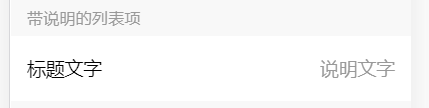
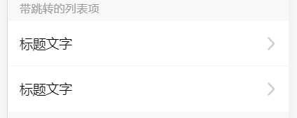
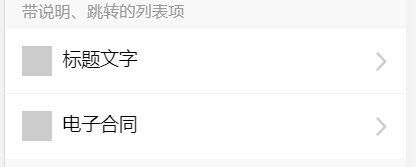

# list-item 

列表项

## 例子

### 带说明的列表项



```html
<div class="ui-info-line">
  <div class="ui-info-item">
    <div class="ui-info-item__desc-left">标题文字</div>
    <div class="ui-info-item__desc-right color-999">说明文字</div>
  </div>
</div>
```

### 带图标、说明的列表项


```html
<div class="ui-info-line ui-mb-10">
  <div class="ui-info-item">
      <div class="ui-icon-wrap">
        <span class="ui-icon-wrap__icon"></span>
        <span class="ui-ml-10">标题文字</span>
      </div>          
      <div class="ui-info-item__desc-right color-999">说明文字</div>
  </div>
  <div class="ui-info-item">
    <div class="ui-icon-wrap">
      <span class="ui-icon-wrap__icon"></span>
      <span class="ui-ml-10">电子合同</span>
    </div>
    <div class="ui-info-item__desc-right color-999">说明文字</div>
  </div>      
</div>
```

### 双行列表项


```html
<div class="ui-info-line">
  <div class="ui-info-item ui-info-item--large">
    <div>
      <p>首行文字15px</p>
      <p class="color-999 f-26 ui-mt-14">2017-05-02 15:48:20</p>
    </div>
    <div class="ui-info-item__desc-right">
      <p>15px</p>
      <p class="color-999 f-26 ui-mt-14">次行13px</p>
    </div>
  </div>
</div>
```

### 带跳转的列表项



```html
<div class="ui-info-line">
  <div class="ui-info-item">
    <div class="ui-info-item__desc-left">标题文字</div>
    <div class="ui-info-item__desc-right color-999"><i class="ui-icon-arrow-right"></i></div>
  </div>
  <div class="ui-info-item">
    <div class="ui-info-item__desc-left">标题文字</div>
    <div class="ui-info-item__desc-right color-999"><i class="ui-icon-arrow-right"></i></div>
  </div>      
</div>
```

### 带说明、跳转的列表项



```html
<div class="ui-info-line">
  <div class="ui-info-item">
    <div class="ui-icon-wrap">
      <span class="ui-icon-wrap__icon"></span>
      <span class="ui-ml-10">标题文字</span>
    </div>
    <div class="ui-info-item__desc-right color-999"><i class="ui-icon-arrow-right"></i></div>
  </div>
  <div class="ui-info-item">
    <div class="ui-icon-wrap">
      <span class="ui-icon-wrap__icon"></span>
      <span class="ui-ml-10">电子合同</span>
    </div>
    <div class="ui-info-item__desc-right color-999"><i class="ui-icon-arrow-right"></i></div>
  </div>      
</div>    
```

### 双行带图标、说明、跳转的列表项


```html
<div class="ui-info-line">
  <div class="ui-info-item ui-info-item--xlarge">
    <div class="ui-icon-wrap">
      <span class="ui-icon-wrap__icon"></span>
      <div class="ui-ml-20">
        <p>招商银行(尾号9286)</p>
        <p class="color-999 f-26 ui-mt-14">单词限额20万元，单日不限额</p>
      </div>
    </div>
    <div class="ui-info-item__desc-right color-999"><i class="ui-icon-arrow-right"></i></div>
  </div>
  <div class="ui-info-item ui-info-item--xlarge">
    <div class="ui-icon-wrap">
      <span class="ui-icon-wrap__icon"></span>          
      <div class="ui-ml-20">
        <p>招商银行(尾号9286)</p>
        <p class="color-999 f-26 ui-mt-14">单次限额20万元，单日不限额</p>
      </div>
    </div>
    <div class="ui-info-item__desc-right"><i class="ui-icon-arrow-right"></i></div>
  </div>      
</div> 
```

### 开关


```html
<div class="ui-info-line">
  <div class="ui-info-item">
    <div class="ui-info-item__desc-left">标题文字</div>
    <div class="ui-info-item__desc-right"><span class="ui-switch-btn"></span></div>
  </div>
  <div class="ui-info-item">
    <div class="ui-info-item__desc-left">标题文字</div>
    <div class="ui-info-item__desc-right"><span class="ui-switch-btn ui-switch-btn--close"></span></div>
  </div>     
</div> 
```
