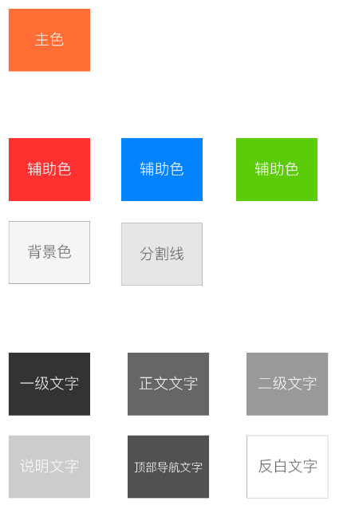

# color 

## 常用颜色



## 使用

```scss
@import '~@jyb/h5_ui_css/src/style/base/variable/color';

.foo {
  color: $color-primary;
}
```

| 变量名          | 颜色 | 描述 |
| --------------  | ------- | -----|
| $color-primary  | #ff6e34 | 主色 |
| $color-red      | #FF3030 | 辅助色 |
| $color-blue     | #5CCB0A | 辅助色 |
| $color-green    | #5CCB0A | 辅助色 |
| $color-bg       | #F5F5F5 | 背景色 |
| $color-border   | #E6E6E6 | 分割线 |
| $color-gray     | #ccc    |  |
| $color-dark-gray| #666    |  |
| $color-white    | #fff    |  |
| $color-dark     | #333    |  |
| $color-light    | #999    |  |
