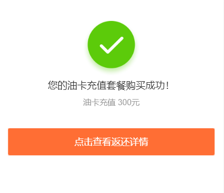
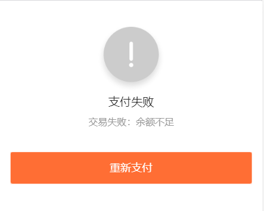

# msg 

结果页

## 例子

### 成功页



```javascript
<div class="ui-msg">
  <div class="ui-msg__icon-area"><i class="ui-icon-success"></i></div>
  <div class="ui-msg__text-area">
    <h2 class="ui-msg__title">您的油卡充值套餐购买成功！</h2>
    <p class="ui-msg__desc">油卡充值 300元</p>
  </div>
  <div class="ui-msg__opr-area">
    <p class="ui-msg__btn-area">
      <a href="javascript:history.back();" class="ui-btn ui-btn--primary">点击查看返还详情</a>
    </p>
  </div>
</div>
```

### 失败页



```javascript
<div class="ui-msg">
  <div class="ui-msg__icon-area"><i class="ui-icon-fail"></i></div>
  <div class="ui-msg__text-area">
    <h2 class="ui-msg__title">支付失败</h2>
    <p class="ui-msg__desc">交易失败：余额不足</p>
  </div>
  <div class="ui-msg__opr-area">
    <p class="ui-msg__btn-area">
      <a href="javascript:history.back();" class="ui-btn ui-btn--primary">重新支付</a>
    </p>
  </div>
</div>
```